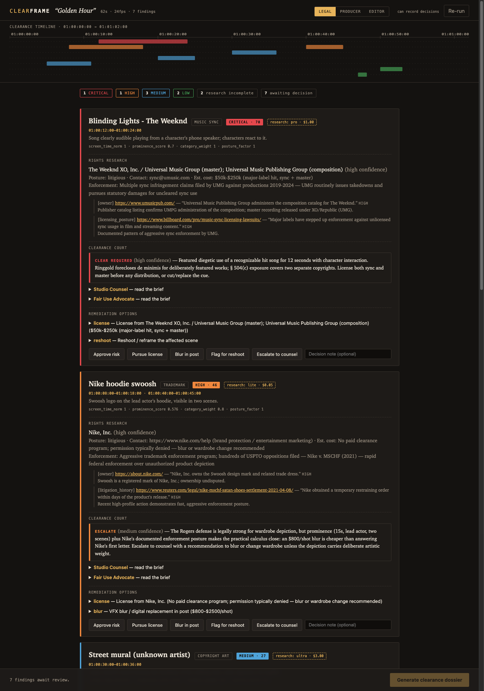
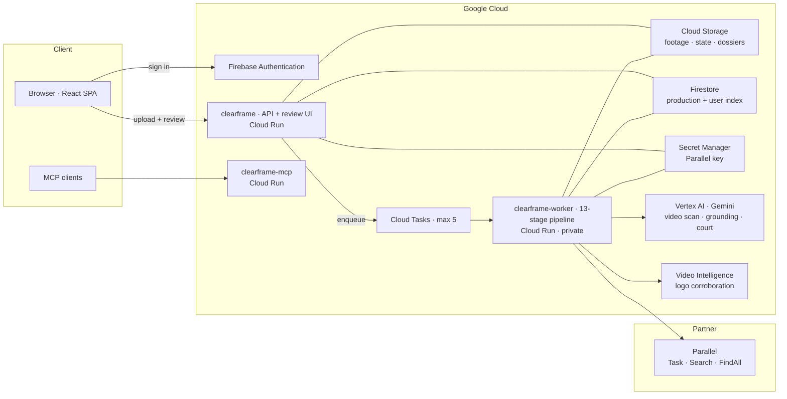
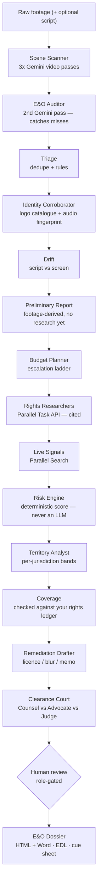
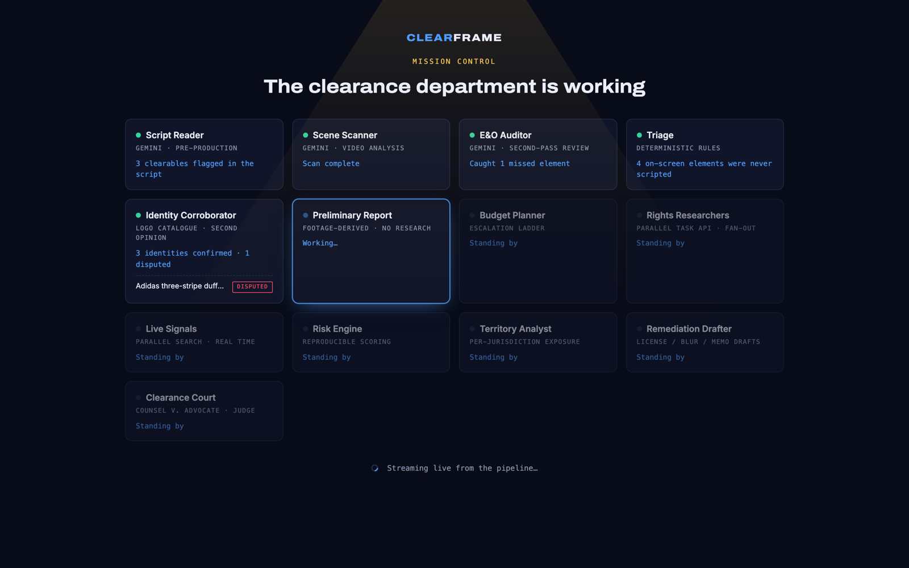

# ClearFrame

**An autonomous rights-clearance department for film & TV.**

Every film must legally "clear" everything visible and audible in frame — logos, artwork, music, tattoos, faces — before distributors or E&O insurers will touch it. One uncleared tattoo nearly stopped *The Hangover Part II*'s $580M release. Today this is done frame-by-frame, by hand.

ClearFrame automates the department: **Gemini** watches raw footage and detects every clearable element; a deterministic multi-agent pipeline deep-researches each rights holder via the **Parallel Task API** (with citations and calibrated confidence as the legal audit trail), scores risk reproducibly, drafts remediation (license outreach emails, VFX blur estimates, de-minimis memos), and produces the industry-standard **clearance dossier**, **NLE timeline markers**, and an **ASCAP/BMI cue sheet** — with a human clearance coordinator approving every finding.

Built for the Google Cloud **Agentic Cinema** hackathon, **Parallel** partner track.

**🌐 Live: [clearframe-q5k3kjzu4a-uc.a.run.app](https://clearframe-q5k3kjzu4a-uc.a.run.app)** — sign up with any email and **choose your role** (legal, producer or editor). Running **live**: real Gemini video analysis and real Parallel research, on your own footage.
**MCP endpoint:** `https://clearframe-mcp-220710110855.us-central1.run.app/mcp` (streamable HTTP)

> Roles are open on this deployment so a first-time visitor can exercise every control without waiting to be granted one. The UI labels a self-selected role `chosen`, and an email the provider has not verified is recorded as `(unverified)` in the audit trail — a self-selected role presented as governance would be worse than none.




## Architecture



Two Cloud Run services split the work: a light public **API** draws the review
screen, and a private **worker** runs the analysis — one job per instance, at
most five at once, with **Cloud Tasks** as the waiting line. Footage, state and
dossiers live in **Cloud Storage**; a per-production and per-user row live in
**Firestore**; **Firebase Auth** is the only user database. Idle cost is `$0`.

## How it works — an agent team, not a prompt



**Detectors observe; code decides.** Every model and detector only *reports* —
the risk score is pure, reproducible code, and a human signs every finding.

**Outputs:** `dossier.html` / `dossier.docx` (E&O report with court opinions and
an append-only audit trail), plus `markers.edl` (NLE), `markers.csv`, and
`cue_sheet.csv` (ASCAP/BMI).

### We don't guess at brands

A misidentified logo is worse than a missed one: it routes rights research to
the wrong company and produces a dossier certifying a clearance nobody
obtained. The E&O Auditor is Gemini reviewing Gemini — same model, same priors,
so it catches *omissions*, not *misidentifications*. So identity gets a second
opinion from a detector of a different kind: a closed-vocabulary logo catalogue
that cannot invent a brand outside it.

| Verdict | Meaning | Effect |
| --- | --- | --- |
| `FINGERPRINTED` | an acoustic fingerprint **measured** the recording | research proceeds; this is what a cue sheet needs |
| `CORROBORATED` | two independent detectors named the same thing | research proceeds |
| `SINGLE_SOURCE` | only the video model saw it (murals and tattoos are outside any catalogue) | research proceeds, flagged in the dossier |
| `CONFLICTED` | the detectors named **different** things | **research is blocked** — a human resolves identity first |

For music the second opinion is not an opinion at all. Gemini listening to a
track and naming it produced "Upbeat Electronic Music" on real footage; rights
research faithfully researched that phrase and returned a plausible owner with
fourteen citations. The recording was "Blinding Lights". So music identity comes
from **acoustic fingerprinting** — spectral peak hashing against a recording
database, a measurement rather than an impression — and a fingerprint outranks a
catalogue match. A description like "upbeat electronic music" is an *absence* of
identity, not a competing claim, so the fingerprint replaces it outright. That
matters because the title flows into an ASCAP/BMI cue sheet, which is a legal
filing to a performing-rights organisation.

### We don't spend twenty minutes learning who owns Coca-Cola

Recall is this product's safety claim, so ClearFrame detects everything. But
detecting everything and *deep-researching* everything are different things, and
conflating them made a 21.8-second clip take twenty minutes: sixteen deep
research runs, six returning no owner, seven of them human faces — and no amount
of web research produces a release form.

Findings now descend an escalation ladder and stop at the first rung that can
actually answer the question their category poses:

| Rung | Resolver | Latency | Cost | Answers |
| --- | --- | --- | --- | --- |
| `LOCAL` | local rights table (151 marks) | 0 ms | $0 | who owns a famous mark |
| `STATUTE` | settled law | 0 ms | $0 | de minimis, release forms, our own captions |
| `SEARCH` | **Parallel Search** | ~2 s | $0.005 | licensing posture, contact, live enforcement |
| `DEEP` | **Parallel Task** | minutes | $0.01–0.30 | genuinely unknown ownership chains |

The routing table is derived from the litigation record rather than from our
category list, and the record inverts the usual intuition: brand owners mostly
*lose* against productions (*Rogers v. Grimaldi*, *Caterpillar v. Disney*,
*Wham-O v. Paramount*) while music publishers reliably win. So a famous logo
gets a two-second lookup and a song gets the deep run. And for trademark the
variable that decides risk is **depiction**, not identity — NBC digitally erased
In-Sink-Erator from *Heroes* only because the scene was unflattering — which is
why a catalogued mark still gets a live posture check instead of being waved
through on a static table.

Ownership is asserted locally because it is a corporate fact that does not change
between runs. **Posture deliberately is not**: whether a rights holder is suing
people this quarter is exactly what a static table cannot know, so it is left
unknown and escalated to a live search. A table that guessed at posture would
repeat the failure mode fingerprinting just fixed.

Nothing is dropped. A finding resolved for free is a *documented position* — the
dossier prints "Resolved without rights research (N of M)" with the authority and
the required action for each, because E&O carriers do not accept fair use offered
in place of clearance and distributors reject incidental use asserted without
documentation.

### Am I already covered?

A song is the hard case: it needs **two** licences from two different companies —
synchronisation for the composition (publisher) and master use for the recording
(label). Holding one and shipping on it is the most common music clearance
failure there is, so music coverage is *assembled* rather than chosen, and a
track reads `COVERED` only when both halves are held, in territory, in term and
in media.


Every other tool answers *"who owns this and what would it cost"*. A director
asks the opposite question first. Upload your clearance register — the licence
list a clearance department already keeps — as CSV or JSON, and every finding is
matched against it:

| State | Meaning |
| --- | --- |
| `COVERED` | a matching grant reaches this use |
| `PARTIAL` | a grant exists but misses **territory**, **term** or **media** — the gap is named |
| `NOT_COVERED` | holder identified, nothing on file |
| `UNKNOWN` | ownership or identity unresolved, so coverage is unknowable |

The media check is the *WKRP in Cincinnati* problem: music cleared for broadcast
and never for home video gutted that show's soundtrack on streaming decades later.

```csv
rights_holder,work,scope,territories,media,starts,expires,reference
Bayer AG,Bayer cross logo,Archival depiction,WORLDWIDE,ALL,2025-01-01,,BAY-2025-01
Kraft Heinz Company,Jell-O trade dress,Product depiction,US|CA,THEATRICAL,2026-01-01,2027-12-31,KHC-14
```

### Clearance is jurisdictional

Distributors buy territories separately, and the same frame is not equally
risky everywhere. The demo mural bands three ways:

| Territory | Band | Authority |
| --- | --- | --- |
| US | MEDIUM | 17 U.S.C. §120(a) — panorama exemption covers *architectural works only* |
| DE | LOW | UrhG §59 (Panoramafreiheit) — works permanently in public places |
| FR | HIGH | CPI art. L.122-5 11° — exception excludes commercial use |

Deterministic table, cited authority per row, and it never touches the
jurisdiction-neutral baseline score.



### The Clearance Court

Every contested finding (MEDIUM risk and up) is argued by two opposing agents: **Studio Counsel** briefs why the use is a risk; the **Fair Use Advocate** briefs the strongest good-faith defense — de minimis, *Rogers v. Grimaldi* expressive-work protection, fair use. Both cite real case law (*Ringgold v. BET*, *Sandoval v. New Line*, *Caterpillar v. Disney*, *Falkner v. GM*, VARA, §504(c)). A **Judge** weighs the briefs against practical cost and issues a ruling: `CLEAR REQUIRED`, `DEFENSIBLE`, or `ESCALATE`. Opinions attach reasoning to the dossier — they never alter the deterministic risk score, and the human still makes the call.

- The pipeline runs both as a plain orchestrator and as a **Google ADK `SequentialAgent`** (`src/clearframe/adk/agents.py`) — try it: `python -m clearframe run --demo --adk --auto-approve --out out` executes the full run under the real ADK Runner.
- Every research finding carries Parallel's **Basis** output — citations, per-field reasoning, calibrated confidence — because a legal document without provenance is worthless.
- Deep research is a snapshot; the **Parallel Search API** adds a live pass over every identified rights holder ("has this company started enforcing since we researched them?"). Priced per request rather than per Task run, so it is affordable to re-run on demand from the review screen — the **Check live signals** button.
- Risk scores are pure code (`src/clearframe/scoring.py`): reproducible from stored inputs, never an LLM guess.

## Bring your own footage

The review app takes an upload, plays it back, and draws every detection's box
on the frame it appears on — labelled with what it is, whether two detectors
agreed, and whether it is already licensed. Clicking a finding scrubs to it.

```bash
./scripts/fetch_test_clips.sh          # 6 public-domain spots, ~2MB each
```

Those come from [archive.org/details/ctvc](https://archive.org/details/ctvc)
(Creative Commons public domain) and are dense with still-live marks — Bayer,
Jell-O, Lipton, Texaco, Playtex, Volkswagen. The films are free; the trademarks
in them are not, which is precisely the gap ClearFrame exists to flag. The
script also writes `ground_truth.json` so detection recall can be scored rather
than eyeballed. `docs/sample-rights-ledger.csv` is a matching register that
produces covered, gapped and unlicensed states against those clips.

Footage upload requires live mode: demo mode replays recorded fixtures, so it
refuses uploads rather than returning the demo scene's findings as yours.

## Quickstart — demo mode (zero credentials, zero network)

```bash
python3 -m venv .venv && source .venv/bin/activate
pip install -e ".[dev]"

# CLI: run pipeline + generate all artifacts
python -m clearframe run --demo --out out --auto-approve
open out/dossier.html

# Or the full review experience:
python -m clearframe serve --out out --port 8000
# open http://127.0.0.1:8000 → Load demo production → review → Generate dossier
```

Demo mode replays recorded Gemini/Parallel responses through the identical pipeline code path. `pytest` runs the whole suite.

## MCP server

The whole clearance department is also an **MCP server** — any MCP client (Gemini Enterprise, Claude, IDEs) can drive it as tools:

```bash
python -m clearframe.mcp --out out   # stdio transport
# tools: run_clearance · get_status · list_findings · get_finding · record_decision
#        verify_identities · territory_report · check_freshness
#        list_licences · check_coverage · generate_dossier
```

Role gating and the append-only audit trail apply identically across all three transports (CLI, web app, MCP) — one shared review service owns the rules. See [docs/deploy.md](docs/deploy.md) for client registration.

## Living clearance — the dossier that refuses to go stale

Clearance isn't an event; it's a subscription. ClearFrame covers the whole lifecycle:

- **Script pre-scan** (pre-production): Gemini reads the screenplay and flags clearables before a frame is shot.
- **Script-vs-screen drift**: elements on camera that were never scripted get a `NOT IN SCRIPT` flag — the set-dressing surprises nobody budgeted clearance for.
- **FindAll leads**: when deep research can't identify an owner (the unsigned mural), a recall-first Parallel FindAll pass enumerates candidate rights holders — registries, the building's owner, archives — instead of leaving a dead end.
- **Standing watch** (post-delivery): after the dossier, a watch is registered per risky finding — new lawsuits, filings, policy changes by the rights holder. Live mode creates Parallel Monitors when the API key includes the Monitors beta, and falls back to local stand-in watches otherwise (demo mode uses the same stand-ins); the webhook alert path is identical either way — an alert **reopens review automatically** and lands in the audit trail. Your dossier can't silently rot.

Run everything yourself: `./scripts/smoke.sh` verifies the full lifecycle across every transport (CLI, web, SSE, webhook, MCP stdio) in one command.

## Guardrails

- **Deterministic risk scoring** — pure code, reproducible from stored inputs; no LLM in the scoring path.
- **Server-side role gating** — only `legal`/`producer` record decisions, enforced in the review service, not the UI.
- **Append-only audit trail** — every decision (including revisions) and dossier generation is logged and printed in the dossier.
- **Research spend cap** — `CLEARFRAME_MAX_RESEARCH` (default 25) bounds the *deep* Parallel fan-out; overflow surfaces as RESEARCH INCOMPLETE, never silently dropped. The free rungs are never capped: dropping them would lose findings for no saving.
- **Every route is recorded** — which rung answered a finding, under what authority, and what the producer must do about it. A faster report that quietly examines less is the failure mode this design exists to avoid.
- **Licence matching ignores corporate furniture** — "Music", "Group", "Records" are shared by half the industry; matching on them once reported a festival-only cue licence as covering a major-label master. Being wrong in the *covered* direction is the one failure the ledger must not have.
- **Gemini safety settings** — explicit `BLOCK_ONLY_HIGH` thresholds on the scan config.
- **Honest failure states** — unidentifiable rights holders escalate; unscanned footage ranges are listed in the report as not covered; a disputed identity is never researched rather than researched wrongly.
- **Independent corroboration** — identity is confirmed by two different kinds of detector, and disagreement blocks the expensive, consequential step.
- **Best-effort degradation** — if the corroborating detector is unavailable, identities stay `SINGLE_SOURCE`; silence is never reported as agreement.
- **Stale-dossier protection** — revising any decision reopens review so an outdated report can't circulate.

## Live mode (Vertex AI Gemini + Parallel Task API)

```bash
pip install -e ".[dev,cloud]"
cp .env.example .env   # fill in project + key, then load it:
set -a && source .env && set +a
python -m clearframe run --live --footage scene.mp4 --title "Golden Hour" --duration-s 62 --out out
```

Footage can be a local mp4 (<20MB, sent inline) or a `gs://` URI. `gemini-3-pro-preview` is tried first and the client falls back to `gemini-2.5-pro` automatically where the preview model isn't available.

Add `--territories US,DE,FR` (or `CLEARFRAME_TERRITORIES`) to band every finding
per release territory. Identity corroboration additionally needs the Video
Intelligence API enabled:

```bash
gcloud services enable videointelligence.googleapis.com
```

If it is not enabled the pipeline still runs — identities simply stay
`SINGLE_SOURCE` rather than being falsely reported as agreed.

See [docs/deploy.md](docs/deploy.md) for Cloud Run and Agent Engine deployment.

## Deployment (Cloud Run, scale-to-zero)

One image, **three services**, `min-instances=0` — idle cost is $0.

| Service | What | Shape |
| --- | --- | --- |
| `clearframe` | review webapp + API | 1 CPU · 512Mi · concurrency **80** · public |
| `clearframe-worker` | runs the 13-stage analysis | 2 CPU · 4Gi · concurrency **1** · max 5 · **not public** |
| `clearframe-mcp` | MCP server, streamable HTTP at `/mcp` | 1 CPU · 512Mi · public |

**Why the split.** One analysis is three concurrent Gemini video passes plus Parallel research plus up to 150 grounding calls; on one service that competes with the requests drawing the review screen. And Cloud Run throttles CPU to near-zero once a response is sent, so the analysis has to happen **inside** the worker's request — a background task started after responding is frozen.

**The cap is the queue.** A Cloud Tasks queue with `max-concurrent-dispatches=5` sits between them, and the worker takes one request per instance with at most five instances. Five analyses run at once; the sixth waits. Cloud Tasks is the waiting line, not a place code runs.

**Storage.** Footage, state, events and dossiers live in Cloud Storage; a small per-production row and a per-user record live in Firestore. Nothing depends on the container's disk, which on Cloud Run is a per-instance tmpfs the worker cannot share. **Firebase Authentication is the user database** — no credentials are stored by this application, and there is no SQL database, because the rest is a handful of documents read by key.

```bash
gcloud builds submit --config cloudbuild.yaml .   # build + deploy all three
./scripts/deploy.sh staging                       # cloud storage, demo detectors, no spend
./scripts/deploy.sh prod                          # cloud storage, live detectors
./scripts/prod-probe.py                           # 25 security checks against the deployed URL
```

### Measured on the live deployment (2026-09-06)

A 42s clip uploaded through the deployed URL by a signed-in user, analysed by the worker, **538s end to end**:

| | |
| --- | --- |
| scan (3 concurrent Gemini passes) | 123s |
| **preliminary report readable** | **168s** |
| research · freshness · risk · territory · coverage · remediation | 267s |
| clearance court | 103s |
| **result** | **10 findings · 3 cast credits · 39/39 appearances boxed** |

Anchor-box grounding on a paused frame: **14.4s cold, 0.61s warm**. Dossier: 225KB HTML + JSON + EDL + CSV markers.

Connect an MCP client to the deployed server:

```bash
claude mcp add --transport http clearframe https://clearframe-mcp-220710110855.us-central1.run.app/mcp
```

## Repository map

```
src/clearframe/
  models.py scoring.py triage.py remediation.py dossier.py   # core domain (no cloud deps)
  corroboration.py territory.py freshness.py matching.py     # verification engines (pure code)
  routing.py knowledge.py audio.py licensing.py              # cost/latency policy + rights knowledge
  data/rights/                   # marks, litigation, counterparties, term rules (JSON)
  pipeline.py stages/            # deterministic 13-stage orchestrator
  integrations/                  # Gemini + Parallel clients (live & fixture) + recorded fixtures
  exporters/                     # dossier HTML, EDL, CSV markers, cue sheet
  adk/                           # Google ADK SequentialAgent wrapper
  webapp/server.py               # FastAPI review API (server-side role enforcement)
webapp/                          # React review UI (prebuilt dist committed)
docs/superpowers/specs|plans/    # design spec and implementation plans
```

## License

MIT — see [LICENSE](LICENSE).

*ClearFrame output is automated decision support, not legal advice.*
